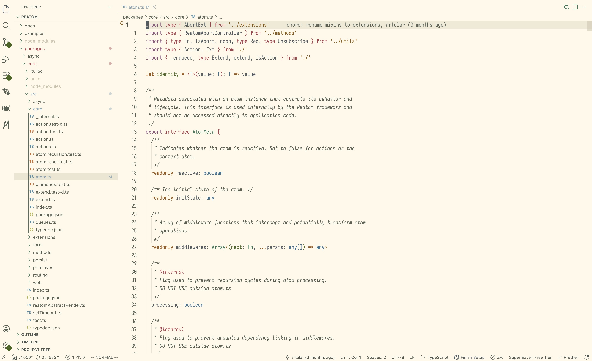
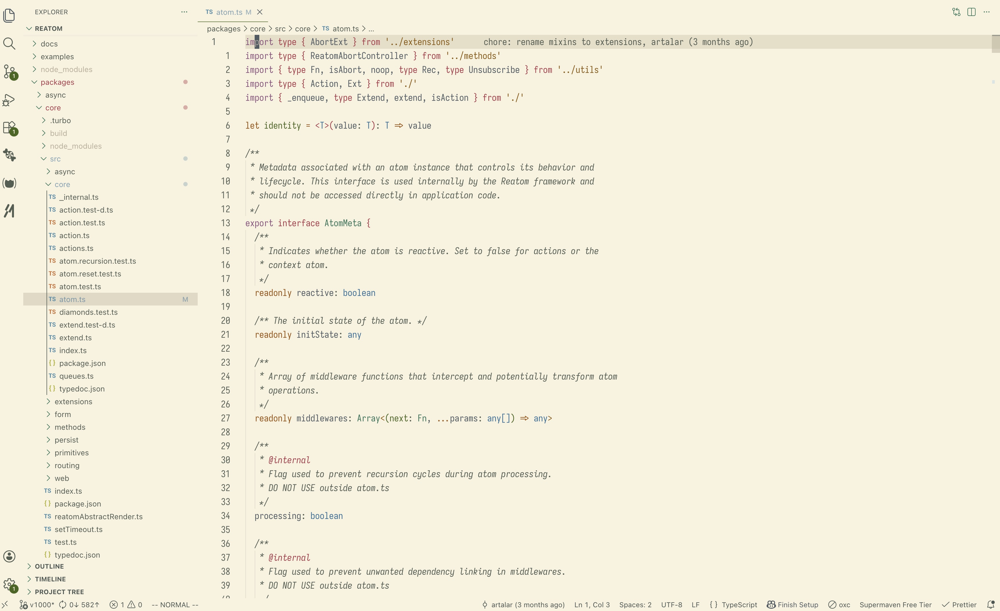
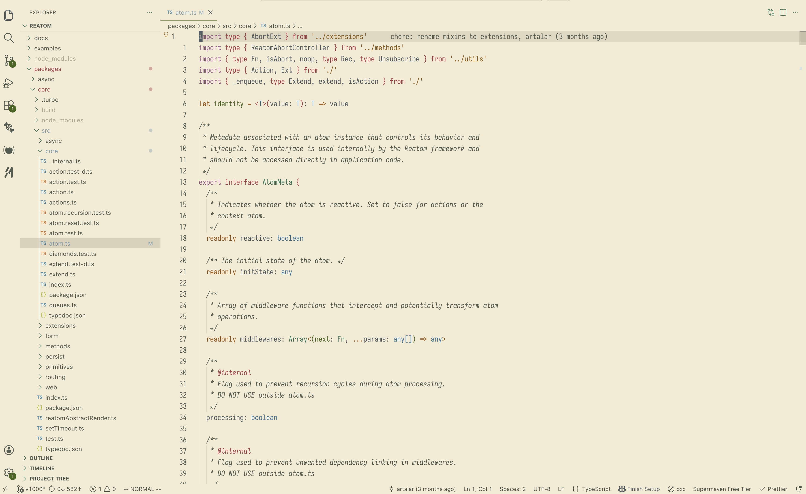

# 🌲 Everforest Night

[](https://marketplace.visualstudio.com/items?itemName=jarith.everforest-night-vscode)
[](https://marketplace.visualstudio.com/items?itemName=jarith.everforest-night-vscode)
[](https://marketplace.visualstudio.com/items?itemName=jarith.everforest-night-vscode&ssr=false#review-details)
[](https://open-vsx.org/extension/jarith/everforest-night-vscode)
[](https://github.com/jarith/everforest-night-vscode/actions/workflows/ci.yml?query=branch%3Amaster)

A green-based theme for Visual Studio Code, designed to stay warm and readable during long coding sessions

### Everforest Night Soft


### Everforest Night Medium


### Everforest Night Hard


### Everforest Night Light Soft



### Everforest Night Light Medium



### Everforest Night Light Hard



Supports both VS Code Desktop and VS Code for the Web.

## Installation

1. Open the Extensions sidebar (`Cmd+Shift+X` / `Ctrl+Shift+X`)
2. Search for **Everforest Night**
3. Click **Install**
4. Open **Preferences: Color Theme**
5. Select one of the built-in variants:
   `Everforest Night Light Soft`, `Everforest Night Light Medium`, `Everforest Night Light Hard`,
   `Everforest Night Soft`, `Everforest Night Medium` or `Everforest Night Hard`

## Theme Variants

| Variant                               | Main Background (`editor.background`) | Description                         |
| ------------------------------------- | ------------------------------------- | ----------------------------------- |
| Everforest Night Hard                 | `#2a3339`                             | Highest contrast in the dark range  |
| Everforest Night Medium               | `#323d43`                             | Balanced dark contrast              |
| Everforest Night Soft                 | `#3c474d`                             | Softest dark background             |
| Everforest Night Light Hard           | `#f3ebd2`                             | Highest contrast in the light range |
| Everforest Night Light Medium         | `#f9f3df`                             | Balanced light contrast             |
| Everforest Night Light Soft           | `#fff9e8`                             | Softest light background            |

## Color Palette

### Dark Main Colors

| Color      | Hex       | Preview                                                       |
| ---------- | --------- | ------------------------------------------------------------- |
| Background | `#323d43` |  |
| Foreground | `#d8caac` |  |
| Red        | `#eda0a1` |  |
| Orange     | `#e9a485` |  |
| Yellow     | `#dbbc7f` |  |
| Green      | `#a7c080` |  |
| Aqua       | `#83c092` |  |
| Blue       | `#86bfb7` |  |
| Purple     | `#dba5bf` |  |

### Dark Background Contrast Variants

| Variant          | Hex       | Preview                                                       |
| ---------------- | --------- | ------------------------------------------------------------- |
| Hard             | `#2a3339` |  |
| Medium (default) | `#323d43` |  |
| Soft             | `#3c474d` |  |

### Light Main Colors

| Color      | Hex       | Preview                                                       |
| ---------- | --------- | ------------------------------------------------------------- |
| Background | `#f9f3df` |  |
| Foreground | `#4f5b62` |  |
| Red        | `#ad3b4a` |  |
| Orange     | `#9a5200` |  |
| Yellow     | `#8c5a00` |  |
| Green      | `#47661b` |  |
| Aqua       | `#2c7459` |  |
| Blue       | `#2e7099` |  |
| Purple     | `#8f537f` |  |

### Light Background Contrast Variants

| Variant          | Hex       | Preview                                                       |
| ---------------- | --------- | ------------------------------------------------------------- |
| Hard             | `#f3ebd2` |  |
| Medium (default) | `#f9f3df` |  |
| Soft             | `#fff9e8` |  |

## Customization

Everforest Night uses static theme files and does not auto-generate large override blocks in `settings.json`.
To customize colors, use VS Code's built-in per-theme override keys.

### Manual overrides example

```jsonc
{
  "workbench.colorTheme": "Everforest Night Medium",
  "workbench.colorCustomizations": {
    "[Everforest Night Medium]": {
      "editorGutter.background": "#323d43",
    },
    "[Everforest Night Hard]": {
      "editorGutter.background": "#2a3339",
    },
    "[Everforest Night Soft]": {
      "editorGutter.background": "#3c474d",
    },
  },
  "editor.tokenColorCustomizations": {
    "[Everforest Night Medium]": {
      "comments": "#aeb6b0",
    },
  },
  "editor.semanticTokenColorCustomizations": {
    "[Everforest Night Medium]": {
      "enabled": true,
      "rules": {
        "enumMember:typescript": "#86bfb7"
      }
    }
  }
}
```

## Acknowledgments

Inspired by [Forest Night](https://github.com/jef/forest-night-jetbrains) by [@jef](https://github.com/jef) and [Everforest](https://github.com/sainnhe/everforest-vscode) by [@sainnhe](https://github.com/sainnhe)

## License

[MIT](LICENSE)
